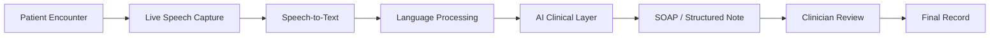
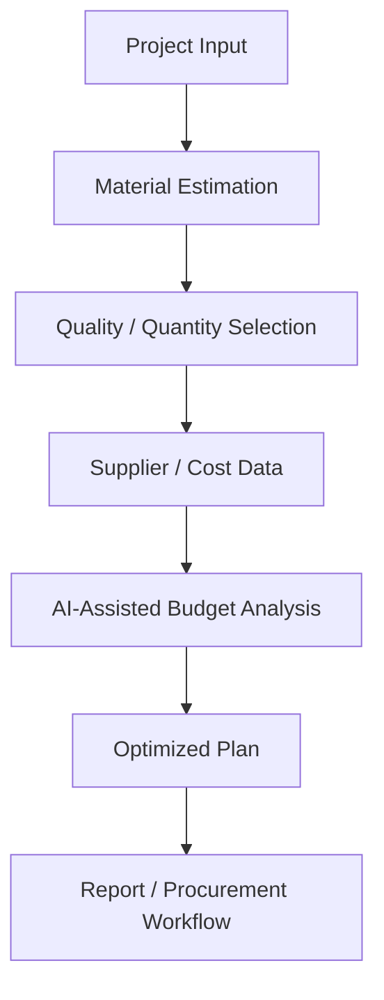
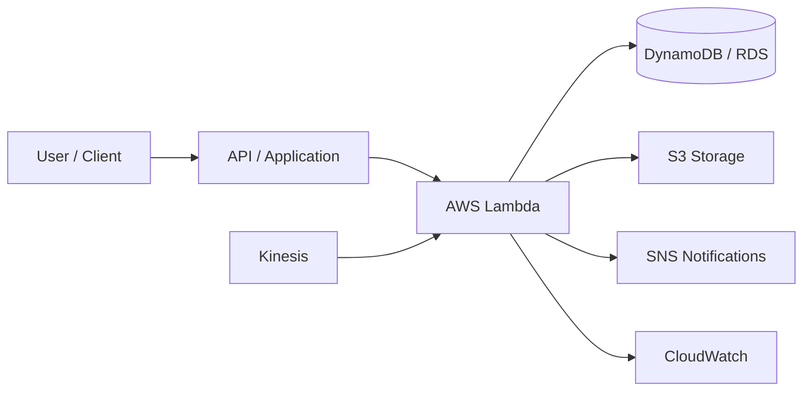
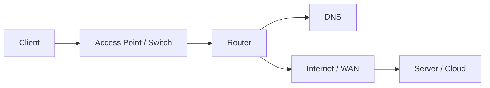
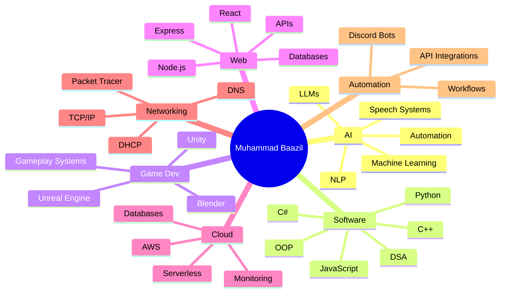

<div align="center">


<br/>

[](https://github.com/mbs-x)
[](https://github.com/mbs-x?tab=followers)
[](https://github.com/mbs-x)

### `Building intelligent software • interactive worlds • useful products`

</div>

---

## 👨‍💻 About Me

I'm **Muhammad Baazil**, a multidisciplinary developer focused on **Artificial Intelligence, software engineering, game development, full-stack web development, cloud computing, networking, automation and 3D workflows**.

I enjoy taking ideas from concept to working product — planning the architecture, writing the code, designing interfaces, connecting APIs, building intelligent workflows and preparing projects for deployment.

- 🤖 AI / ML / NLP / LLM-powered systems
- 🎮 Unity, Unreal Engine, C#, C++ and Blender
- 🌐 Full-stack websites, dashboards, APIs and web applications
- ☁️ AWS, cloud architecture and serverless concepts
- 🌍 Networking fundamentals, TCP/IP, DHCP, DNS and Packet Tracer
- 🤖 Discord bots, automation systems and API integrations
- 🧠 DSA, OOP, algorithms, problem solving and software architecture
- 🐧 Linux / Ubuntu, Git and GitHub workflows

```yaml
name: Muhammad Baazil
username: mbs-x
role: AI & Software Developer
focus:
  - Artificial Intelligence
  - Software Engineering
  - Game Development
  - Full-Stack Development
  - Cloud Computing
  - Networking
  - Automation
currently_building:
  - SKMC Scribe
learning:
  - Machine Learning
  - NLP
  - Cloud Architecture
  - Production AI Systems
mindset: "Build. Learn. Improve. Ship."
```

---

## 🚀 Current Focus

| Area | Focus |
|---|---|
| 🤖 **AI / ML** | Intelligent applications, NLP, LLM integrations, speech systems |
| 🎮 **Game Development** | Unity, Unreal Engine, gameplay systems, C#, C++, 3D workflows |
| 🌐 **Web Development** | Full-stack apps, dashboards, APIs, responsive interfaces |
| ☁️ **Cloud** | AWS, serverless systems, storage, monitoring, databases |
| 🌍 **Networking** | TCP/IP, DHCP, DNS, routing concepts, Packet Tracer |
| 🤖 **Automation** | Discord bots, API automation, workflow tools |
| 🧠 **Core CS** | DSA, OOP, algorithms, problem solving, system thinking |

---

## 🧰 Technology Universe

### 👨‍💻 Programming Languages
<p align="center"></p>
<div align="center"><b>C++ • C# • Python • JavaScript • Dart • SQL • 8086 Assembly fundamentals</b></div>

### 🤖 Artificial Intelligence & Machine Learning
<p align="center"></p>
<div align="center"><b>Artificial Intelligence • Machine Learning • NLP • LLMs • Speech-to-Text • AI Integrations • Intelligent Automation • Prompt Engineering</b></div>

### 🎮 Game Development & 3D
<p align="center"></p>
<div align="center"><b>Unity • Unreal Engine • Blender • Gameplay Programming • Game Systems • Android Builds • 3D Workflows</b></div>

### 🌐 Web & Application Development
<p align="center"></p>
<div align="center"><b>React • Node.js • Express.js • REST APIs • HTML5 • CSS3 • JavaScript • Flutter • Firebase • Responsive Interfaces</b></div>

### 🗄️ Databases & Backend
<p align="center"></p>
<div align="center"><b>MySQL • MongoDB • Mongoose • SQLite • Database Design • CRUD Systems • Backend APIs • Data Modeling</b></div>

### ☁️ Cloud, DevOps & Systems
<p align="center"></p>
<div align="center"><b>AWS • Git • GitHub • Linux • Ubuntu • Bash • Deployment • Cloud Architecture • Serverless Concepts • CI/CD Concepts</b></div>
<div align="center">`Lambda` • `Kinesis` • `DynamoDB` • `S3` • `SNS` • `CloudWatch` • `RDS` • `Aurora` • `Redshift`</div>

### 🌍 Networking & Automation
<div align="center">


</div>

**Computer Networks • TCP/IP • DHCP • DNS • Routing & Switching fundamentals • Packet Tracer • Discord Bots • Event-Driven Logic • API Integrations • Automated Workflows**

---

## 🧠 Core Computer Science

<div align="center">


</div>

I've worked with **binary search, stacks, queues, linked lists, trees, BSTs, AVL trees, recursion, sorting, graph/search algorithms, BFS, DFS, UCS, DLS, IDS, Greedy Best-First Search, A*, IDA*, RBFS, hill climbing and minimax**.

---

## 🩺 Flagship Project — SKMC Scribe

<div align="center">

### AI-Powered Clinical Documentation Platform
`Healthcare AI` • `Speech-to-Text` • `NLP` • `SOAP Notes` • `Workflow Automation` • `Multilingual Systems`

</div>

**SKMC Scribe** is designed to help healthcare professionals spend less time on documentation and more time focusing on patients.

- 🎙️ Real-time speech-to-text
- 🌍 Multilingual transcription workflows
- 🤖 AI-powered clinical note generation
- 📋 Structured SOAP documentation
- 🧩 Customizable clinical templates
- 📑 Encounter and worklist management
- ✍️ Clinical review and sign-off workflows
- 🔄 End-to-end documentation flow
- 🧠 AI-assisted transformation of conversations into structured notes
- 🎨 Modern web-based clinical interface



---

## 🏗️ Construction Planning & Cost Estimation System

A software concept focused on **construction planning, material estimation, quality-based costing, budget optimization and supplier-oriented workflows**.

<div align="center">`Flutter` • `Dart` • `Node.js` • `Express.js` • `MongoDB` • `SQLite` • `REST APIs` • `AI-Assisted Budget Optimization` • `PDF Reporting`</div>



---

## 🎮 Game Development

| Engine / Tool | What I Use It For |
|---|---|
| 🎮 **Unity** | Gameplay programming, C# systems, Android projects, interactive experiences |
| 🔥 **Unreal Engine** | Real-time 3D, game concepts, C++ / visual workflows |
| 🧊 **Blender** | 3D modeling workflows, game assets and scene preparation |
| 💻 **C#** | Unity gameplay scripts, systems and logic |
| ⚙️ **C++** | Game logic, performance-oriented programming and core CS concepts |

`Gameplay Systems` • `Player Mechanics` • `Game Logic` • `UI Systems` • `Android Builds` • `3D Workflows` • `Interactive Systems` • `Multiplayer Concepts`

---

## ☁️ Cloud & AWS Journey

🏆 **AWS Academy Cloud Foundations**



My cloud interests include **serverless design, deployment, monitoring, managed databases, storage, event-driven systems and scalable backend architecture**.

---

## 🌍 Networking Knowledge

- TCP/IP fundamentals
- DHCP and DNS
- Client-server communication
- Network addressing concepts
- Router / access point concepts
- Packet Tracer labs
- Network troubleshooting fundamentals
- Linux networking concepts



---

## 🤖 Discord Bots & Automation

I build and explore **Discord bots and automation workflows** using event-driven programming, commands, APIs and backend logic.

`Commands` • `Events` • `Moderation Logic` • `Utility Features` • `API Calls` • `Automated Replies` • `Data Storage` • `Workflow Automation`

---

## 🗺️ My Development Map



---

## 📈 Skill Direction

```text
Artificial Intelligence   ████████████████████░  Deepening
Software Engineering      ████████████████████░  Core Focus
Game Development          ███████████████████░░  Strong Interest
Web Development           ███████████████████░░  Active
Cloud Computing           ████████████████░░░░░  Growing
Networking                ███████████████░░░░░░  Solid Foundation
3D / Blender              █████████████░░░░░░░░  Expanding
```

---

## 🏅 Developer Highlights

<div align="center">


</div>

---

## 🐍 Contribution Snake

<div align="center">

<picture>
  <source media="(prefers-color-scheme: dark)" srcset="https://raw.githubusercontent.com/mbs-x/mbs-x/gh-pages/github-contribution-grid-snake-dark.svg">
  <source media="(prefers-color-scheme: light)" srcset="https://raw.githubusercontent.com/mbs-x/mbs-x/gh-pages/github-contribution-grid-snake.svg">
  
</picture>

</div>

---

# 📊 GitHub Analytics

<div align="center">

### 🔥 Contribution Streak


<br/><br/>

### ⚡ Live Developer Metrics

<a href="https://github.com/mbs-x?tab=repositories"></a>
<a href="https://github.com/mbs-x?tab=followers"></a>


<br/>

<a href="https://github.com/mbs-x"></a>
<a href="https://github.com/mbs-x?tab=repositories"></a>

</div>

### 📈 Engineering Activity

| Metric | Live destination |
| :--- | :--- |
| 🔥 **Contribution streak** | Visualized above and updates from GitHub activity |
| 🟩 **Contribution calendar** | [Open my live contribution graph →](https://github.com/mbs-x) |
| 📦 **Repositories & projects** | [Explore my repositories →](https://github.com/mbs-x?tab=repositories) |
| 👥 **Developer network** | [View followers →](https://github.com/mbs-x?tab=followers) |
| 🐍 **Contribution history** | Animated continuously by the snake above |

> **Consistency • Progress • Better Code** — the analytics section is designed to grow automatically as my GitHub activity grows.

---

## 🤝 Let's Build Something

I'm open to interesting work and collaboration around:

<div align="center">


</div>

### 📬 Connect With Me

<div align="center">

<a href="mailto:muhammadbaazilsulaiman@gmail.com"></a>
<a href="https://www.linkedin.com/in/muhammad-baazil/"></a>
<a href="https://github.com/mbs-x"></a>

<br/><br/>

📧 **muhammadbaazilsulaiman@gmail.com** &nbsp; • &nbsp; 💼 **LinkedIn: Muhammad Baazil** &nbsp; • &nbsp; 💻 **@mbs-x**

<br/>

### 💻 Code. 🎮 Create. 🤖 Innovate.

**Thanks for visiting — let's build something that matters. 🚀**


</div>