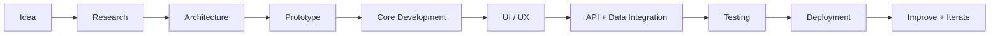
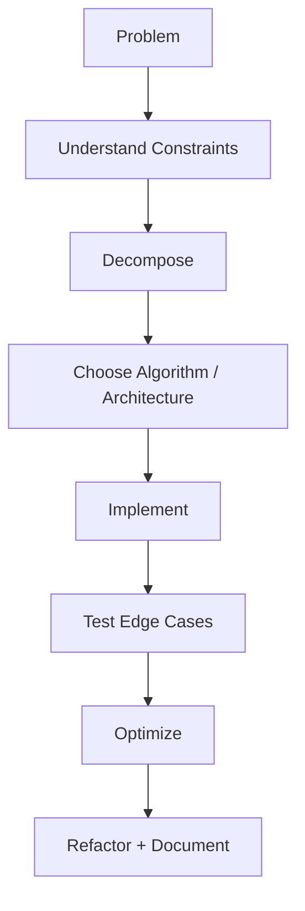
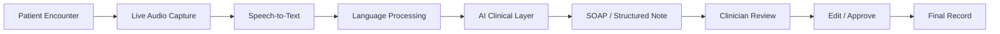
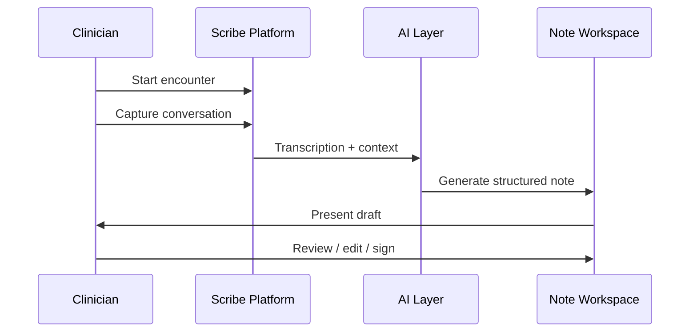
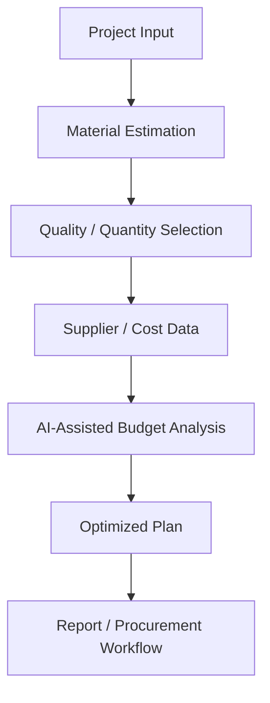
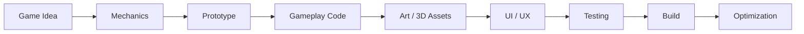
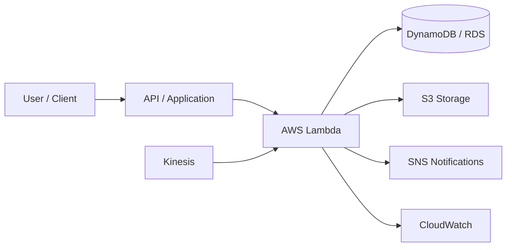
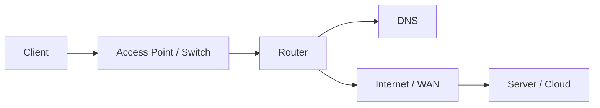
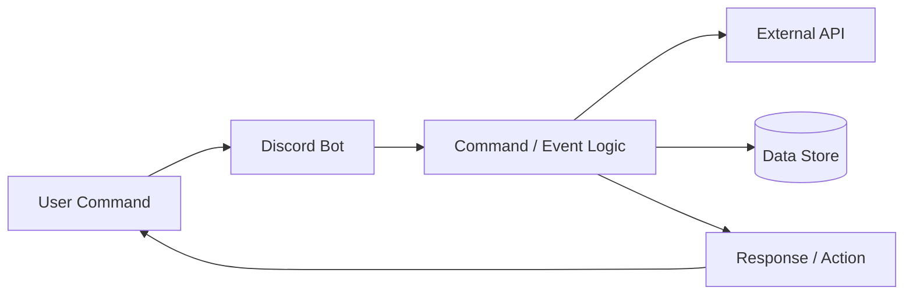
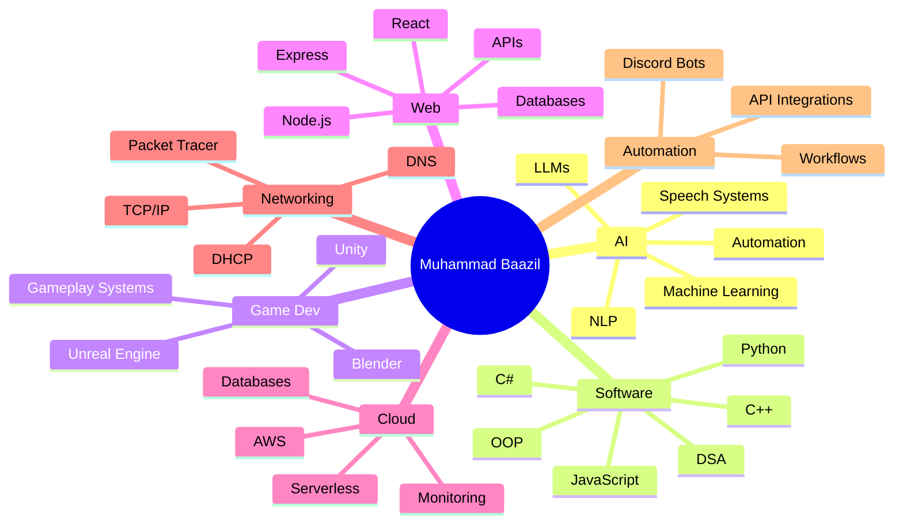

<div align="center">


<br/>

[](https://github.com/mbs-x)
[](https://github.com/mbs-x?tab=followers)
[](https://github.com/mbs-x)
[](mailto:muhammadbaazilsulaiman@gmail.com)
[](https://www.linkedin.com/in/muhammad-baazil/)

### `Building intelligent software • interactive worlds • useful products`

</div>

---

## 🧭 Developer Command Center

<div align="center">

| 🤖 AI Builder | 🎮 Game Developer | 🌐 Full-Stack Developer | ☁️ Cloud + Networks |
|:---:|:---:|:---:|:---:|
| ML • NLP • LLMs | Unity • Unreal • Blender | React • Node • APIs | AWS • TCP/IP • Linux |
| Speech Systems | C# • C++ • Gameplay | Databases • Auth • UI | DHCP • DNS • Serverless |
| Automation | 3D Workflows | Web Apps • Dashboards | Monitoring • Deployment |

</div>

```text
SYSTEM STATUS
━━━━━━━━━━━━━━━━━━━━━━━━━━━━━━━━━━━━━━━━━━━━━━━━━━━━━━━━━━━━━━
AI / ML                [████████████████████]  ACTIVE FOCUS
SOFTWARE ENGINEERING   [████████████████████]  CORE
GAME DEVELOPMENT       [███████████████████░]  ACTIVE
WEB DEVELOPMENT        [███████████████████░]  ACTIVE
CLOUD COMPUTING        [████████████████░░░░]  GROWING
NETWORKING             [███████████████░░░░░]  SOLID BASE
3D / BLENDER           [█████████████░░░░░░░]  EXPANDING
AUTOMATION / BOTS      [████████████████░░░░]  ACTIVE
━━━━━━━━━━━━━━━━━━━━━━━━━━━━━━━━━━━━━━━━━━━━━━━━━━━━━━━━━━━━━━
```

---

## 👨‍💻 About Me

I'm **Muhammad Baazil**, a multidisciplinary developer focused on **Artificial Intelligence, software engineering, game development, full-stack web development, cloud computing, networking, automation and 3D workflows**.

I like working across the complete development lifecycle — **idea → architecture → implementation → UI → integration → testing → deployment**. My strongest motivation is building systems that are not just technically interesting, but actually useful.

<table>
<tr>
<td width="50%" valign="top">

### 🚀 What I Work On

- 🤖 AI / ML / NLP / LLM-powered systems
- 🎙️ Speech-to-text and intelligent workflows
- 🎮 Unity / Unreal gameplay systems
- 🧊 Blender and 3D game workflows
- 🌐 Full-stack websites and dashboards
- 🔌 REST APIs and backend systems
- ☁️ AWS and serverless concepts
- 🌍 Networking fundamentals and labs
- 🤖 Discord bots and automation
- 🧠 DSA, OOP and problem solving

</td>
<td width="50%" valign="top">

### ⚙️ Developer Snapshot

```yaml
name: Muhammad Baazil
username: mbs-x
role: AI & Software Developer
location: Lahore, Pakistan
current_project: SKMC Scribe
specialties:
  - AI / ML / NLP
  - Game Development
  - Full-Stack Development
  - Cloud Computing
  - Networking
  - Automation
mindset: "Build. Learn. Improve. Ship."
```

</td>
</tr>
</table>

---

## 🛠️ What I Can Build

<div align="center">

| Category | Examples |
|---|---|
| 🤖 **AI Systems** | AI assistants, NLP workflows, speech pipelines, structured note generation, LLM integrations |
| 🎮 **Games & Interactive Apps** | Unity gameplay systems, Android games, Unreal concepts, C# logic, Blender assets |
| 🌐 **Web Platforms** | Full-stack apps, dashboards, authentication, REST APIs, responsive interfaces |
| 🔌 **Backend Systems** | Node.js services, Express APIs, databases, CRUD systems, integrations |
| 🤖 **Bots & Automation** | Discord bots, event-driven workflows, utility bots, API automation |
| ☁️ **Cloud Systems** | AWS/serverless concepts, storage, monitoring, managed databases, deployments |
| 🌍 **Networking** | DHCP/DNS labs, Packet Tracer, addressing, routing concepts, troubleshooting |

</div>

---

## 🔄 How I Build



<div align="center">

**Think clearly → build modularly → test realistically → improve continuously**

</div>

---

## 🚀 Current Focus

| Area | Focus |
|---|---|
| 🤖 **AI / ML** | Intelligent applications, NLP, LLM integrations, speech systems |
| 🎮 **Game Development** | Unity, Unreal Engine, gameplay systems, C#, C++, 3D workflows |
| 🌐 **Web Development** | Full-stack apps, dashboards, APIs, responsive interfaces |
| ☁️ **Cloud** | AWS, serverless systems, storage, monitoring, databases |
| 🌍 **Networking** | TCP/IP, DHCP, DNS, routing concepts, Packet Tracer |
| 🤖 **Automation** | Discord bots, API automation, workflow tools |
| 🧠 **Core CS** | DSA, OOP, algorithms, problem solving, system thinking |

---

# 🧰 Technology Universe

## 👨‍💻 Programming Languages
<p align="center"></p>
<div align="center"><b>C++ • C# • Python • JavaScript • Dart • SQL • 8086 Assembly fundamentals</b></div>

## 🤖 Artificial Intelligence & Machine Learning
<p align="center"></p>
<div align="center"><b>Artificial Intelligence • Machine Learning • NLP • LLMs • Speech-to-Text • AI Integrations • Intelligent Automation • Prompt Engineering</b></div>

## 🎮 Game Development & 3D
<p align="center"></p>
<div align="center"><b>Unity • Unreal Engine • Blender • Gameplay Programming • Game Systems • Android Builds • 3D Workflows</b></div>

## 🌐 Web & Application Development
<p align="center"></p>
<div align="center"><b>React • Node.js • Express.js • REST APIs • HTML5 • CSS3 • JavaScript • Flutter • Firebase • Responsive Interfaces</b></div>

## 🗄️ Databases & Backend
<p align="center"></p>
<div align="center"><b>MySQL • MongoDB • Mongoose • SQLite • Database Design • CRUD Systems • Backend APIs • Data Modeling</b></div>

## ☁️ Cloud, DevOps & Systems
<p align="center"></p>
<div align="center"><b>AWS • Git • GitHub • Linux • Ubuntu • Bash • Deployment • Cloud Architecture • Serverless Concepts • CI/CD Concepts</b></div>

<div align="center">

`Lambda` • `Kinesis` • `DynamoDB` • `S3` • `SNS` • `CloudWatch` • `RDS` • `Aurora` • `Redshift`

</div>

## 🌍 Networking & Automation
<div align="center">


</div>

**Computer Networks • TCP/IP • DHCP • DNS • Routing & Switching fundamentals • Packet Tracer • Discord Bots • Event-Driven Logic • API Integrations • Automated Workflows**

---

## 🧠 Core Computer Science

<div align="center">


</div>

I've worked with **binary search, stacks, queues, linked lists, trees, BSTs, AVL trees, recursion, sorting, graph/search algorithms, BFS, DFS, UCS, DLS, IDS, Greedy Best-First Search, A*, IDA*, RBFS, hill climbing and minimax**.

### 🧩 Problem-Solving Mindset



---

# 🩺 Flagship Project — SKMC Scribe

<div align="center">

## AI-Powered Clinical Documentation Platform

`Healthcare AI` • `Speech-to-Text` • `NLP` • `SOAP Notes` • `Workflow Automation` • `Multilingual Systems`

</div>

**SKMC Scribe** is designed to help healthcare professionals spend less time on documentation and more time focusing on patients.

<table>
<tr>
<td width="50%" valign="top">

### ✨ Core Product Features

- 🎙️ Real-time speech-to-text
- 🌍 Multilingual transcription workflows
- 🤖 AI-powered clinical note generation
- 📋 Structured SOAP documentation
- 🧩 Customizable clinical templates
- 📑 Encounter/worklist management
- ✍️ Clinical review and sign-off
- 🔄 End-to-end documentation workflow

</td>
<td width="50%" valign="top">

### 🧠 Product Thinking

- Conversation → structured clinical record
- Human review before finalization
- Workflow-first design
- Reusable template system
- Multilingual capture and output
- AI assistance without removing clinician control
- Focus on reducing documentation burden

</td>
</tr>
</table>

### 🧭 SKMC Scribe Architecture



### 🔁 Clinical Workflow



---

# 🏗️ Construction Planning & Cost Estimation System

A software concept focused on **construction planning, material estimation, quality-based costing, budget optimization and supplier-oriented workflows**.

<div align="center">

`Flutter` • `Dart` • `Node.js` • `Express.js` • `MongoDB` • `SQLite` • `REST APIs` • `AI-Assisted Budget Optimization` • `PDF Reporting`

</div>



---

# 🎮 Game Development

<div align="center">

| Engine / Tool | What I Use It For |
|---|---|
| 🎮 **Unity** | Gameplay programming, C# systems, Android projects, interactive experiences |
| 🔥 **Unreal Engine** | Real-time 3D, game concepts, C++ / visual workflows |
| 🧊 **Blender** | 3D modeling workflows, game assets and scene preparation |
| 💻 **C#** | Unity gameplay scripts, systems and logic |
| ⚙️ **C++** | Game logic, performance-oriented programming and core CS concepts |

</div>

### 🕹️ Game Development Pipeline



### 🎯 Areas I Explore

`Gameplay Systems` • `Player Mechanics` • `Game Logic` • `UI Systems` • `Android Builds` • `3D Workflows` • `Interactive Systems` • `Multiplayer Concepts`

---

# ☁️ Cloud & AWS Journey

<div align="center">

🏆 **AWS Academy Cloud Foundations**

</div>



My cloud interests include **serverless design, deployment, monitoring, managed databases, storage, event-driven systems and scalable backend architecture**.

---

# 🌍 Networking Knowledge

<table>
<tr>
<td width="50%" valign="top">

### 🌐 Core Concepts
- TCP/IP fundamentals
- DHCP and DNS
- Client-server communication
- IP addressing concepts
- Router / access point concepts
- Routing & switching fundamentals

</td>
<td width="50%" valign="top">

### 🛠️ Practical Work
- Cisco Packet Tracer labs
- Network configuration
- Troubleshooting fundamentals
- Linux networking concepts
- LAN/WAN thinking
- Network-aware application design

</td>
</tr>
</table>



---

# 🤖 Discord Bots & Automation

I build and explore **Discord bots and automation workflows** using event-driven programming, commands, APIs and backend logic.

<div align="center">

`Commands` • `Events` • `Moderation Logic` • `Utility Features` • `API Calls` • `Automated Replies` • `Data Storage` • `Workflow Automation`

</div>



---

# 🗺️ My Development Map



---

# 🧭 Learning Roadmap

<div align="center">

| Topic | Direction |
|---|---|
| 🤖 Machine Learning | Deeper models, practical pipelines, evaluation |
| 🧠 NLP / LLMs | Better structured generation, multilingual systems |
| ☁️ Cloud | More production-grade architecture and deployment |
| 🎮 Game Systems | Better architecture, gameplay patterns, optimization |
| 🌐 Full-Stack | Cleaner scalable apps and integrations |
| 🔐 Backend / Systems | Reliability, security, data flow and architecture |

</div>

```text
2026 ROADMAP
AI SYSTEMS          ████████████████████  PRIORITY
NLP / LLMs          ███████████████████░  PRIORITY
CLOUD ARCHITECTURE  ████████████████░░░░  GROWING
GAME SYSTEMS        █████████████████░░░  ACTIVE
WEB PLATFORMS       █████████████████░░░  ACTIVE
NETWORKING          ███████████████░░░░░  FOUNDATION
```

---

# 🏅 Developer Highlights

<div align="center">


</div>

---

# 🐍 Contribution Snake

<div align="center">

<picture>
  <source media="(prefers-color-scheme: dark)" srcset="https://raw.githubusercontent.com/mbs-x/mbs-x/gh-pages/github-contribution-grid-snake-dark.svg">
  <source media="(prefers-color-scheme: light)" srcset="https://raw.githubusercontent.com/mbs-x/mbs-x/gh-pages/github-contribution-grid-snake.svg">
  
</picture>

</div>

---

# 📊 GitHub Analytics

<div align="center">

### 🔥 Contribution Streak


<br/><br/>

### ⚡ Live Developer Metrics

<a href="https://github.com/mbs-x?tab=repositories"></a>
<a href="https://github.com/mbs-x?tab=followers"></a>


<br/>

<a href="https://github.com/mbs-x"></a>
<a href="https://github.com/mbs-x?tab=repositories"></a>

</div>

### 📈 Engineering Activity

| Metric | Live destination |
| :--- | :--- |
| 🔥 **Contribution streak** | Visualized above and updates from GitHub activity |
| 🟩 **Contribution calendar** | [Open my live contribution graph →](https://github.com/mbs-x) |
| 📦 **Repositories & projects** | [Explore my repositories →](https://github.com/mbs-x?tab=repositories) |
| 👥 **Developer network** | [View followers →](https://github.com/mbs-x?tab=followers) |
| 🐍 **Contribution history** | Animated continuously by the snake above |

> **Consistency • Progress • Better Code** — the analytics section grows automatically with my GitHub activity.

---

# 💼 Collaboration & Opportunities

<div align="center">

| I’m interested in | Examples |
|---|---|
| 🤖 **AI / ML** | Intelligent applications, LLM integrations, NLP systems |
| 🎮 **Game Development** | Unity, Unreal, C#, C++, interactive systems |
| 🌐 **Web Apps** | Full-stack platforms, dashboards, APIs |
| 🩺 **Healthcare Tech** | Clinical workflows, speech/NLP systems, documentation tools |
| ☁️ **Cloud** | Serverless systems, deployment, scalable backends |
| 🌍 **Networking** | Network-aware apps, labs, infrastructure concepts |
| 🤖 **Automation** | Discord bots, API integrations, intelligent workflows |
| 🚀 **Open Source** | Interesting collaborative engineering projects |

</div>

---

# 📬 Connect With Me

<div align="center">

<a href="mailto:muhammadbaazilsulaiman@gmail.com"></a>
<a href="https://www.linkedin.com/in/muhammad-baazil/"></a>
<a href="https://github.com/mbs-x"></a>

<br/><br/>

📧 **muhammadbaazilsulaiman@gmail.com**  
💼 **LinkedIn: Muhammad Baazil**  
💻 **GitHub: @mbs-x**

</div>

---

## 🖥️ Terminal

```bash
$ whoami
Muhammad Baazil

$ role
AI & Software Developer | Game Developer | Full-Stack Developer

$ currently-building
SKMC Scribe

$ interests
AI ML NLP Games Web Cloud Networking Automation

$ philosophy
Build. Learn. Improve. Ship.
```

<div align="center">

### 💻 Code. 🎮 Create. 🤖 Innovate.

**Thanks for visiting — let's build something that matters. 🚀**


</div>