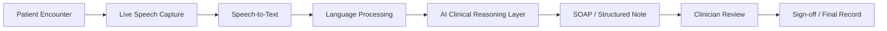
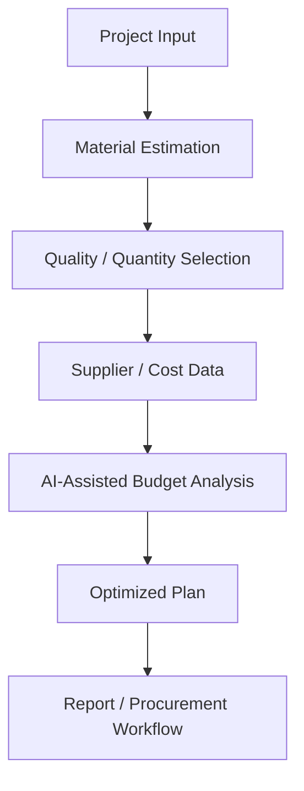
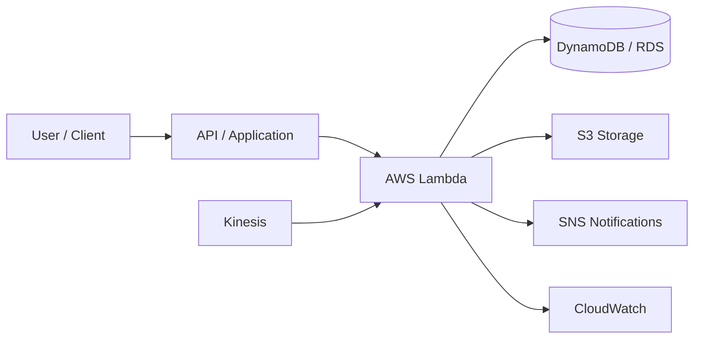
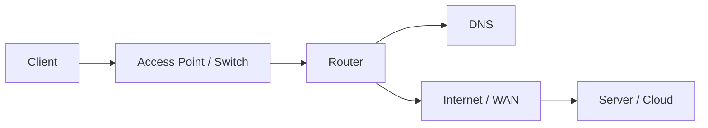
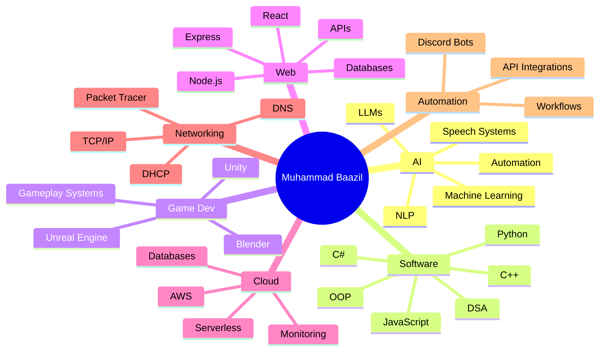

<div align="center">


<a href="https://github.com/mbs-x">
  
</a>

<br/>

[](https://github.com/mbs-x)
[](https://github.com/mbs-x?tab=followers)
[](https://github.com/mbs-x)

### `Building intelligent software • interactive worlds • useful products`

</div>

---

# 👨‍💻 About Me

<table>
<tr>
<td width="58%" valign="top">

I'm **Muhammad Baazil**, a developer with interests spanning **Artificial Intelligence, software engineering, game development, full-stack web development, cloud computing, networking, automation and 3D workflows**.

I enjoy working across the complete development cycle — from an idea, to architecture, to coding, to UI, to integration, to deployment.

- 🤖 Building and exploring **AI / ML / NLP / LLM-powered systems**
- 🎮 Developing with **Unity, Unreal Engine, C#, C++ and Blender**
- 🌐 Creating **full-stack websites, dashboards, APIs and web applications**
- ☁️ Learning and applying **AWS, cloud architecture and serverless concepts**
- 🌍 Working with **networking fundamentals, TCP/IP, DHCP, DNS and Packet Tracer**
- 🤖 Creating **Discord bots, automation systems and API integrations**
- 🧠 Strong interest in **DSA, OOP, algorithms, problem solving and software architecture**
- 🐧 Comfortable working with **Linux / Ubuntu, Git and GitHub workflows**

</td>
<td width="42%" valign="top">

### ⚡ Developer Snapshot

```yaml
name: Muhammad Baazil
username: mbs-x
focus:
  - Artificial Intelligence
  - Software Engineering
  - Game Development
  - Full-Stack Development
  - Cloud Computing
  - Networking
  - Automation
currently_building:
  - SKMC Scribe
learning:
  - Machine Learning
  - NLP
  - Cloud Architecture
  - Production AI Systems
mindset: "Build. Learn. Improve. Ship."
```

</td>
</tr>
</table>

---

# 🚀 Current Focus

<div align="center">

| Area | Focus |
|---|---|
| 🤖 **AI / ML** | Intelligent applications, NLP, LLM integrations, speech systems |
| 🎮 **Game Development** | Unity, Unreal Engine, gameplay systems, C#, C++, 3D workflows |
| 🌐 **Web Development** | Full-stack apps, dashboards, APIs, responsive interfaces |
| ☁️ **Cloud** | AWS, serverless systems, storage, monitoring, databases |
| 🌍 **Networking** | TCP/IP, DHCP, DNS, routing concepts, Packet Tracer |
| 🤖 **Automation** | Discord bots, API automation, workflow tools |
| 🧠 **Core CS** | DSA, OOP, algorithms, problem solving, system thinking |

</div>

---

# 🧰 Technology Universe

## 👨‍💻 Programming Languages

<p align="center">
  
</p>

<div align="center">

**C++ • C# • Python • JavaScript • Dart • SQL • Assembly / 8086 fundamentals**

</div>

## 🤖 Artificial Intelligence & Machine Learning

<p align="center">
  
</p>

<div align="center">

**Artificial Intelligence • Machine Learning • NLP • LLMs • Speech-to-Text • AI Integrations • Intelligent Automation • Prompt Engineering • Structured AI Workflows**

</div>

## 🎮 Game Development & 3D

<p align="center">
  
</p>

<div align="center">

**Unity • Unreal Engine • Blender • Gameplay Programming • Game Systems • Android Builds • 3D Assets / Workflows • C# • C++**

</div>

## 🌐 Web & Application Development

<p align="center">
  
</p>

<div align="center">

**React • Node.js • Express.js • REST APIs • HTML5 • CSS3 • JavaScript • Flutter • Firebase • Responsive Interfaces • Dashboards • Authentication Workflows**

</div>

## 🗄️ Databases & Backend

<p align="center">
  
</p>

<div align="center">

**MySQL • MongoDB • Mongoose • SQLite • Database Design • CRUD Systems • Backend APIs • Data Modeling**

</div>

## ☁️ Cloud, DevOps & Systems

<p align="center">
  
</p>

<div align="center">

**AWS • Git • GitHub • Linux • Ubuntu • Bash • Deployment • Cloud Architecture • Serverless Concepts • CI/CD Concepts**

</div>

### AWS Services I've Worked With / Studied

<div align="center">

`Lambda` • `Kinesis` • `DynamoDB` • `S3` • `SNS` • `CloudWatch` • `RDS` • `Aurora` • `Redshift`

</div>

## 🌍 Networking

<div align="center">


**Computer Networks • TCP/IP • DHCP • DNS • Network Configuration • Packet Tracer • Client/Server Concepts • Routing & Switching Fundamentals**

</div>

## 🤖 Bots, Automation & Integrations

<div align="center">


**Discord Bots • API Integrations • Automated Workflows • Utility Bots • Event-Driven Logic • Backend Automation**

</div>

## 🎨 Design, 3D & Development Tools

<p align="center">
  
</p>

<div align="center">

**Figma • Blender • Visual Studio Code • Visual Studio • Git • GitHub • Trello**

</div>

---

# 🧠 Core Computer Science

<div align="center">


</div>

I've worked with concepts including **binary search, stacks, queues, linked lists, trees, BSTs, AVL trees, recursion, sorting, graph/search algorithms, BFS, DFS, UCS, DLS, IDS, Greedy Best-First Search, A*, IDA*, RBFS, hill climbing and minimax**.

I also have experience with **C++ problem solving, object-oriented programming and low-level 8086 assembly concepts**.

---

# 🩺 Flagship Project — SKMC Scribe

<div align="center">

### AI-Powered Clinical Documentation Platform

`Healthcare AI` • `Speech-to-Text` • `NLP` • `SOAP Notes` • `Workflow Automation` • `Multilingual Systems`

</div>

**SKMC Scribe** is designed to help healthcare professionals spend less time on documentation and more time focusing on patients.

### ✨ Main Capabilities

- 🎙️ Real-time speech-to-text
- 🌍 Multilingual transcription workflows
- 🤖 AI-powered clinical note generation
- 📋 Structured SOAP documentation
- 🧩 Customizable clinical templates
- 📑 Encounter and worklist management
- ✍️ Clinical review and sign-off workflows
- 🔄 End-to-end documentation flow
- 🧠 AI-assisted transformation of conversations into structured notes
- 🎨 Modern web-based clinical interface

### 🧭 Product Flow



---

# 🏗️ Construction Planning & Cost Estimation System

A software concept focused on **construction planning, material estimation, quality-based costing, budget optimization and supplier-oriented workflows**.

### ⚙️ Technology Direction

<div align="center">

`Flutter` • `Dart` • `Node.js` • `Express.js` • `MongoDB` • `SQLite` • `REST APIs` • `AI-Assisted Budget Optimization` • `PDF Reporting`

</div>

### 🧭 System Concept



---

# 🎮 Game Development

Game development is a major part of my technical journey. I enjoy combining **programming, systems thinking, UI, interaction and 3D design**.

<div align="center">

| Engine / Tool | What I Use It For |
|---|---|
| 🎮 **Unity** | Gameplay programming, C# systems, Android projects, interactive experiences |
| 🔥 **Unreal Engine** | Game development concepts, real-time 3D, C++ / visual workflows |
| 🧊 **Blender** | 3D modeling workflows, game assets and scene preparation |
| 💻 **C#** | Unity gameplay scripts, systems and logic |
| ⚙️ **C++** | Game logic, performance-oriented programming and core CS concepts |

</div>

### 🎯 Areas I Like Exploring

`Gameplay Systems` • `Player Mechanics` • `Game Logic` • `UI Systems` • `Android Builds` • `3D Workflows` • `Interactive Systems` • `Multiplayer Concepts`

---

# ☁️ Cloud & AWS Journey

I work with cloud computing concepts and have completed **AWS Academy Cloud Foundations**.

<div align="center">

🏆 **AWS Academy Cloud Foundations**

</div>

### ☁️ Architecture Concepts



My cloud interests include **serverless design, application deployment, monitoring, managed databases, storage, event-driven systems and scalable backend architecture**.

---

# 🌍 Networking Knowledge

Networking gives me a stronger understanding of how applications communicate beyond just writing code.

### Areas I've worked with / studied

- TCP/IP fundamentals
- DHCP and DNS
- Client-server communication
- Network addressing concepts
- Router / access point concepts
- Packet Tracer labs
- Network troubleshooting fundamentals
- Linux networking concepts



---

# 🤖 Discord Bots & Automation

I also create **Discord bots and automation workflows**, combining event-driven programming, commands, APIs and backend logic.

Typical bot capabilities can include:

`Commands` • `Events` • `Moderation Logic` • `Utility Features` • `API Calls` • `Automated Replies` • `Data Storage` • `Workflow Automation`

---

# 🗺️ My Development Map



---

# 📈 Skill Direction

```text
Artificial Intelligence   ████████████████████░  Deepening
Software Engineering      ████████████████████░  Core Focus
Game Development          ███████████████████░░  Strong Interest
Web Development           ███████████████████░░  Active
Cloud Computing           ████████████████░░░░░  Growing
Networking                ███████████████░░░░░░  Solid Foundation
3D / Blender              █████████████░░░░░░░░  Creative Skill
Automation / Bots         ████████████████░░░░░  Active
```

---

# 📊 GitHub Analytics

<div align="center">


</div>

---

# 🏆 GitHub Trophies

<div align="center">


</div>

---

# 📉 Contribution Graph

<div align="center">


</div>

---

# 🐍 Contribution Snake

<div align="center">

<picture>
  <source media="(prefers-color-scheme: dark)" srcset="https://raw.githubusercontent.com/mbs-x/mbs-x/output/github-contribution-grid-snake-dark.svg">
  <source media="(prefers-color-scheme: light)" srcset="https://raw.githubusercontent.com/mbs-x/mbs-x/output/github-contribution-grid-snake.svg">
  
</picture>

</div>

---

# 💡 Engineering Philosophy

<div align="center">

> ### **Don't just learn technology — build something with it.**

</div>

I like projects that combine multiple disciplines. A single project might involve **AI + APIs + frontend + backend + databases + cloud + networking + UX**, and that cross-disciplinary approach is what I enjoy most about software development.

My long-term direction is to become stronger at building **complete, scalable and intelligent software products** rather than focusing only on isolated code snippets.

---

# 🤝 Open To

<div align="center">


**AI / ML • Healthcare Tech • Game Development • Web Applications • Cloud Projects • Automation • Discord Bots • Open Source • Interesting Software Ideas**

</div>

---

# 📫 Connect

<div align="center">

<a href="https://github.com/mbs-x"></a>
<a href="mailto:muhammadbaazilsulaiman@gmail.com"></a>

</div>

---

<div align="center">

### 💻 Code • 🎮 Create • 🤖 Innovate • 🚀 Ship

**Thanks for visiting my profile.**

⭐ Follow my journey as I build across **AI, software, games, web, cloud and automation**.


</div>
